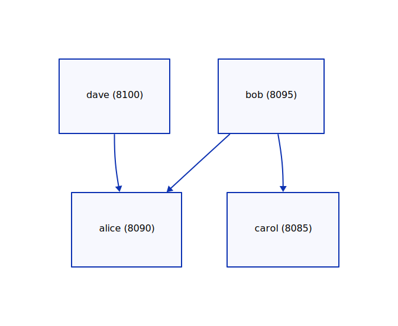

# AreaNet

A peer-to-peer network controller.

This is a command-line tool to connect, and be connected, with remote peers.
The purpose of this network is just to explore peer-to-peer networks, with two immediate goals:

1. **Connectivity**: This means try to maintain connections, try to reconnect when the connection
  goes down, try to automatically connect to other nodes
2. **Awareness**: Try to make every node of the network avare of every other nodes.

## Table of Contents

1. [Getting Started](#getting-started)
    1. [Prerequisites](#prerequisites)
    2. [Installing](#installing)
    3. [Running the tests](#running-the-tests)
    4. [Running the example](#running-the-example)
2. [Usage](#usage)
    1. [Configuration](#configuration)
    2. [Visualization](#visualization)
3. [Documentation](#documentation)
4. [Development](#development)
    1. [Contributing](#contributing)
    2. [Versioning](#versioning)
    3. [Authors](#authors)
5. [License](#license)
6. [Acknowledgments](#acknowledgments)

## Getting started

Please follow these instructions to get a copy of the project up and running.
This project is in development phase, and is intended for testing only.

### Prerequisites

This is a rust project, so you'll need to install it:
- [Getting Started with Rust](https://www.rust-lang.org/learn/get-started)
- Optional, for visualization, Terrastruct's [d2](https://github.com/terrastruct/d2)

### Installing

You need to download and build the project, using the following instructions:

```
git clone https://github.com/crocme10/area-net.git
cd area-net
cargo build --release
./target/release/area-net -h
```

### Running the tests

Use `cargo test` to run unit tests.

### Running the example

The project comes with 5 profiles for testing basic functionalities, bob, alice, carol, dave, and erin.



You can see each profile's configuration in 'config/network/[PROFILE].toml'. These profiles essentially
specify the unique port of each profile, as seen in the diagram above. The profile also links to the
list of initial addresses each profile should connect to. These are found in 'profiles/[PROFILE].json',
and they contain an array, in JSON format, of network addresses (IPv6). Again, this is shown in the
diagram above, as directed edges between each profile.

You can start all these profiles by hand, or use the script `start.sh`.

#### Script

1. Start one controller for each profile, with bob having the option to visualize the network.
2. Wait for a keypress to terminate one or all of these processes: Use the first letter of the profile's
   name to terminate that process, or q to terminate them all.

If you want to [visualize](#visualization) the network as it evolves (from bob's perspective), you need to:

1. Make sure [d2](https://github.com/terrastruct/d2) is installed.
2. Remove previously existing files:
    ```
    rm profiles/bob/peers.d2
    rm profiles/bob/peers.svg
    touch profiles/bob/peers.d2
    ```
3. Start d2's watch on the peers.d2 file:
    ```
    d2 --watch profiles/bob/peers.d2
    ```
    At that point it should open a webpage in your default browser, with a blank page because the
    network is empty.
4. Start all the profiles
    ```
    ./start.sh
    ```
5. Observe in your browser how the network evolves as you terminate nodes with the script.

#### Manual

If you start each controller manually
```
./area-net -c ./config -p [PROFILE]
```

where profile is in {bob, alice, carol, dave}.

Then each window will display the logs, showing what each profile is doing, as seen in the following
screenshot:


## Usage

### Configuration

The application is configured using layers where each layer stores key/value settings.
Each setting in a layer overrides the corresponding setting in the layers below.
There are 3 layers:

- at the base level, the **default layer** provides an exhaustive set of default values.
- then the **profile layer** can override some settings for a given profile.
- finally the **command-line layer** can override some settings present in the layers below.
  The command-line has no persistence, so it is meant only for one-off situations.

The command line is sparse, and contains essentially these three components:

```
area-net -c [CONFIG DIR] -p [PROFILE] -s [KEY1=VALUE] -s [KEY2=VALUE]
```

* A **config directory**: this is required, and provides the application with
  default configuration values.
* A **profile name**: this is optional, but most likely important to get the 
  correct behavior
* Finally, individual configuration settings can be overriden with the command line.

The configuration directory has the following hierarchy:

```
config/
└- network/
   ├ default.toml
   └ <profile>.toml
```

So, for example, if you want to create a profile for testing, which listens to
port 8901, you would create a file `config/network/testing.toml` with the
following content:

```toml
[network.controller.listen]
port = 8901
```

and run the application with the command:

```
area-net -c config -p testing
```

There is one additional configuration file, which contains the list of initial peers the node should connect to. This
file is identified by a configuration setting, `config.network.target.path`, for example, in `config/network/bob.toml`:

```toml
[...]

[network.controller.target]
path = "profile/bob.json"
```

If the path is relative, it is relative to the current working directory, which is the root of the project. So the application
expects to find a file in `profile/bob.json` containing an array of addresses serialized in JSON format, eg:

```JSON
[
    "[::1]:8090",
    "[::1]:8095"
]
```
### Visualization

One of the goal of the project is to become aware of the network. Since it is dynamic in nature, the application
offers a tool to have a real-time visualization of the network. It is currently very limited in functionality.

The visualization works by dumping, along the `peers.json`, a `peers.d2` file. This file is watched by the 
`d2 --watch` command line, which publishes a rendered svg image on a web page.

This feature is accessible for a profile using either the configuration file, or the command-line:

```
./target/release/area-net -c ./config -p bob -s '"network.controller.d2" = true'
```

This diagram displays each node, with its label and port.
It also shows connections, with their round trip time in microseconds.

## Documentation

Read more about the design of this project [here](/documentation/README.md)

## Development

### Contributing

Coming Soon.

### Versioning

We use [Semantic Versioning](http://semver.org/) for versioning. For the versions
available, see the [tags on this
repository](https://github.com/crocme10/area-net/tags).

### Authors

  - **Matthieu Paindavoine** [crocme10](https://github.com/crocme10)

## License

This project is licensed under the [MIT License](LICENSE.md)

## Acknowledgments
